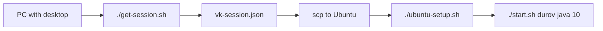

# VK Session Parser

## 1. Get the session on your computer

Run this on a computer with a normal desktop and browser:

```bash
chmod +x get-session.sh
./get-session.sh
```

It will open Chromium. Log in to VK, return to the terminal, and press `Enter`.

This creates:

```bash
vk-session.json
```

## 2. Copy the session to Ubuntu Server 22.04

```bash
scp vk-session.json user@YOUR_SERVER:/home/user/SpringMonolit/
```

## 3. Prepare Ubuntu Server 22.04

Run on the server:

```bash
chmod +x ubuntu-setup.sh start.sh
./ubuntu-setup.sh
```

## 4. Start checking posts

Examples:

```bash
./start.sh durov
./start.sh durov java 10
./start.sh wall-1 news 20
```

Arguments:

- `durov` or `wall-1`: page to open
- `java` or `news`: optional text filter
- `10` or `20`: how many posts to inspect

## 5. Use a custom session path if needed

```bash
VK_SESSION_FILE=/home/user/secrets/vk-session.json ./start.sh durov java 10
```

## Quick flow


