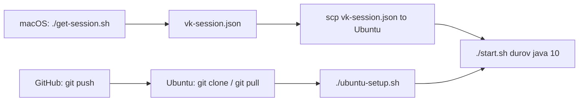

# Ubuntu Quick Start

## 1. Забрать проект через git

```bash
git clone https://github.com/see1234/VKOnline.git
cd VKOnline
```

## 2. Поставить зависимости

```bash
chmod +x ubuntu-setup.sh start.sh
./ubuntu-setup.sh
```

## 3. Передать `vk-session.json` с macOS

На `macOS` сначала получи сессию:

```bash
./get-session.sh
```

Потом скопируй её на сервер:

```bash
scp vk-session.json user@YOUR_SERVER:/home/user/VKOnline/
```

## 4. Запустить проверку постов

```bash
./start.sh durov
./start.sh durov java 10
./start.sh wall-1 news 20
```

## 5. Запустить “вечный онлайн”

```bash
chmod +x online.sh
./online.sh
```

Примеры:

```bash
./online.sh 240 feed
./online.sh 300 im
```

Это best-effort keepalive через браузерную сессию VK.

## 6. Обновлять код через git

Когда в GitHub появятся новые коммиты:

```bash
cd /home/user/VKOnline
git pull
```

## 6. Если сессия лежит отдельно

```bash
VK_SESSION_FILE=/home/user/secrets/vk-session.json ./start.sh durov java 10
```

## Поток


