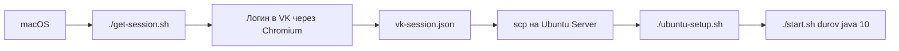

# VK Post Checker

Проверка постов VK через обычную браузерную сессию, без `access_token`.

Проект работает так:

- на `macOS` ты один раз логинишься в VK через браузер
- проект сохраняет сессию в файл `vk-session.json`
- этот файл переносится на `Ubuntu Server 22.04`
- сервер запускает headless-проверку постов через ту же сессию

## Как это устроено



## Что лежит в проекте

- [get-session.sh](/Users/see1/IdeaProjects/SpringMonolit/get-session.sh) — получить `vk-session.json` на `macOS`
- [start.sh](/Users/see1/IdeaProjects/SpringMonolit/start.sh) — запуск проверки постов
- [ubuntu-setup.sh](/Users/see1/IdeaProjects/SpringMonolit/ubuntu-setup.sh) — установка зависимостей на `Ubuntu Server 22.04`
- [README-UBUNTU.md](/Users/see1/IdeaProjects/SpringMonolit/README-UBUNTU.md) — короткая Ubuntu-выжимка

## Требования на macOS

- установлен `Java`
- есть доступ к браузеру и графическому интерфейсу
- проект открыт локально

Проверка Java:

```bash
java -version
```

## Шаг 1. Получить сессию на macOS

В корне проекта:

```bash
chmod +x get-session.sh
./get-session.sh
```

Что произойдёт:

1. Gradle запустит приложение
2. откроется Chromium через Playwright
3. ты вручную войдёшь в VK
4. вернёшься в терминал и нажмёшь `Enter`
5. рядом с проектом появится файл `vk-session.json`

Итог:

```bash
vk-session.json
```

Если хочешь сохранить файл в другое место:

```bash
VK_SESSION_FILE="$HOME/Desktop/vk-session.json" ./get-session.sh
```

## Шаг 2. Перенести сессию на Ubuntu Server

Пример копирования:

```bash
scp vk-session.json user@YOUR_SERVER:/home/user/SpringMonolit/
```

Если положил файл не в корень проекта, это тоже нормально. Тогда потом просто укажешь путь через `VK_SESSION_FILE`.

## Шаг 3. Подготовить Ubuntu Server 22.04

На сервере:

```bash
cd /home/user/SpringMonolit
chmod +x ubuntu-setup.sh start.sh
./ubuntu-setup.sh
```

Скрипт:

- поставит `OpenJDK 21`
- поставит системные библиотеки для Playwright/Chromium
- прогреет Gradle и скомпилирует проект

## Шаг 4. Запустить проверку постов на сервере

Примеры:

```bash
./start.sh durov
./start.sh durov java 10
./start.sh wall-1 news 20
```

Где:

- `durov` или `wall-1` — страница/стена
- `java` или `news` — необязательный фильтр по тексту
- `10` или `20` — сколько постов проверять

## Запуск с другим путём к сессии

Если `vk-session.json` лежит не в корне проекта:

```bash
VK_SESSION_FILE=/home/user/secrets/vk-session.json ./start.sh durov java 10
```

## Самый короткий сценарий

### На macOS

```bash
./get-session.sh
scp vk-session.json user@YOUR_SERVER:/home/user/SpringMonolit/
```

### На Ubuntu

```bash
./ubuntu-setup.sh
./start.sh durov java 10
```

## Что делать, если сессия протухла

Если VK разлогинит сессию:

1. снова запускаешь на `macOS`:

```bash
./get-session.sh
```

2. заново копируешь новый `vk-session.json` на сервер
3. снова запускаешь `./start.sh ...`

## Важные замечания

- `vk-session.json` содержит данные браузерной сессии, не коммить его в git и не отправляй посторонним
- файл уже добавлен в `.gitignore`
- текущая логика читает страницу VK через DOM, поэтому если VK сильно поменяет верстку, парсер может потребовать правки
- для сервера не нужен GUI, потому что проверка идёт в headless-режиме

## Команды проекта

Получить сессию:

```bash
./get-session.sh
```

Подготовить Ubuntu:

```bash
./ubuntu-setup.sh
```

Проверить посты:

```bash
./start.sh <vk_owner> [query] [count]
```
# VKOnline
# VKOnline
# VKOnline
# VKOnline
# VKOnline
