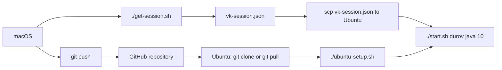

# VK Post Checker

Проверка постов VK через обычную браузерную сессию, без `access_token`.

Нормальный сценарий работы такой:

- на `macOS` ты получаешь `vk-session.json`
- проект хранится в GitHub
- на `Ubuntu Server 22.04` сервер подтягивает код через `git clone` или `git pull`
- сессия `vk-session.json` копируется на сервер отдельно
- сервер запускает headless-проверку постов

## Схема



## Репозиторий

GitHub-репозиторий проекта:

```bash
https://github.com/see1234/VKOnline.git
```

## Что лежит в проекте

- [get-session.sh](/Users/see1/IdeaProjects/SpringMonolit/get-session.sh) — получить `vk-session.json` на `macOS`
- [start.sh](/Users/see1/IdeaProjects/SpringMonolit/start.sh) — запуск проверки постов
- [online.sh](/Users/see1/IdeaProjects/SpringMonolit/online.sh) — best-effort режим “вечного онлайна”
- [ubuntu-setup.sh](/Users/see1/IdeaProjects/SpringMonolit/ubuntu-setup.sh) — установка зависимостей на `Ubuntu Server 22.04`
- [README-UBUNTU.md](/Users/see1/IdeaProjects/SpringMonolit/README-UBUNTU.md) — короткая Ubuntu-выжимка

## Требования на macOS

- установлен `Java`
- есть браузер и GUI
- проект склонирован локально

Проверка Java:

```bash
java -version
```

## Шаг 1. Получить сессию на macOS

В корне проекта:

```bash
chmod +x get-session.sh
./get-session.sh
```

Что произойдёт:

1. Gradle запустит приложение
2. откроется Chromium через Playwright
3. ты вручную войдёшь в VK
4. вернёшься в терминал и нажмёшь `Enter`
5. появится файл `vk-session.json`

Если хочешь сохранить файл в другое место:

```bash
VK_SESSION_FILE="$HOME/Desktop/vk-session.json" ./get-session.sh
```

- `vk-session.json` в git не идёт
- файл уже добавлен в `.gitignore`

## Шаг 2. Подтянуть проект на Ubuntu через git

### Первый запуск на Ubuntu Server 22.04

```bash
git clone https://github.com/see1234/VKOnline.git
cd VKOnline
chmod +x ubuntu-setup.sh start.sh
./ubuntu-setup.sh
```

### Следующие обновления на Ubuntu

```bash
cd VKOnline
git pull
```

## Шаг 3. Передать сессию на Ubuntu отдельно

Сессия передаётся не через git, а отдельно:

```bash
scp vk-session.json user@YOUR_SERVER:/home/user/VKOnline/
```

Если хочешь хранить её не в корне проекта:

```bash
scp vk-session.json user@YOUR_SERVER:/home/user/secrets/vk-session.json
```

## Шаг 4. Запустить проверку постов на Ubuntu

Если `vk-session.json` лежит в корне проекта:

```bash
cd /home/user/VKOnline
./start.sh durov
./start.sh durov java 10
./start.sh wall-1 news 20
```

Если `vk-session.json` лежит отдельно:

```bash
cd /home/user/VKOnline
VK_SESSION_FILE=/home/user/secrets/vk-session.json ./start.sh durov java 10
```

## Шаг 5. Запустить “вечный онлайн”

Если хочешь держать аккаунт активным через ту же сессию:

```bash
cd /home/user/VKOnline
./online.sh
```

Свой интервал и цель:

```bash
./online.sh 240 feed
./online.sh 300 im
```

Где:

- `240` или `300` — интервал heartbeat в секундах
- `feed` или `im` — страница VK, на которой будет держаться активность

Важно:

- это `best-effort`, а не гарантированный “навсегда online”
- если VK разлогинит сессию, heartbeat остановится с ошибкой
- чем меньше интервал, тем выше нагрузка и тем заметнее автоматизация

## Что делает `ubuntu-setup.sh`

Скрипт:

- ставит `OpenJDK 21`
- ставит системные библиотеки для Playwright/Chromium
- прогревает Gradle
- компилирует проект

## Самый короткий сценарий

### На macOS

```bash
./get-session.sh
git add .
git commit -m "update project"
git push
scp vk-session.json user@YOUR_SERVER:/home/user/VKOnline/
```

### На Ubuntu

```bash
git clone https://github.com/see1234/VKOnline.git
cd VKOnline
./ubuntu-setup.sh
./online.sh 240 feed
./start.sh durov java 10
```

### Обновление Ubuntu после новых коммитов

```bash
cd /home/user/VKOnline
git pull
./start.sh durov java 10
```

## Что делать, если сессия протухла

Если VK разлогинит сессию:

1. на `macOS` снова запускаешь:

```bash
./get-session.sh
```

2. заново копируешь `vk-session.json` на сервер
3. код через git трогать не нужно, если менялась только сессия

## Важные замечания

- `vk-session.json` содержит данные браузерной сессии, не коммить его в git и не отправляй посторонним
- для сервера не нужен GUI, потому что проверка идёт в headless-режиме
- текущая логика читает страницу VK через DOM, поэтому если VK поменяет верстку, парсер может потребовать правки
- `online.sh` не даёт 100% гарантии статуса online, а только регулярно поддерживает активность через браузерную сессию

## Основные команды

Получить сессию:

```bash
./get-session.sh
```

Подготовить Ubuntu:

```bash
./ubuntu-setup.sh
```

Проверить посты:

```bash
./start.sh <vk_owner> [query] [count]
```

Запустить keepalive:

```bash
./online.sh [interval_seconds] [target]
```

Обновить код на Ubuntu:

```bash
git pull
```
